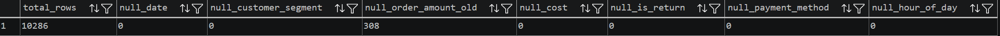
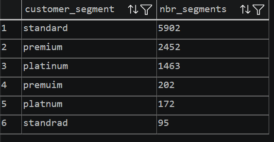
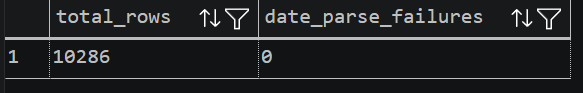
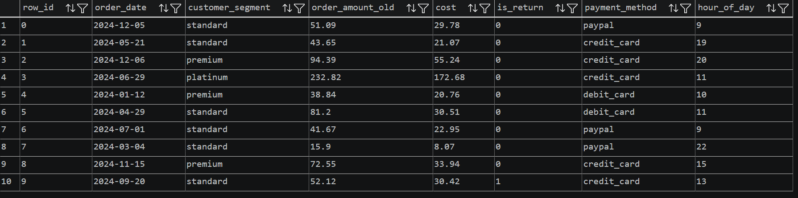
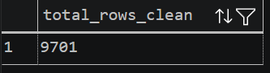
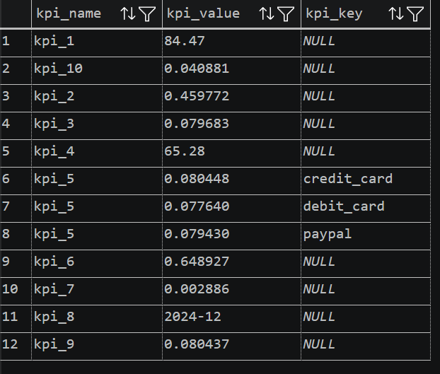

# Proyecto SQL: Limpieza de Datos y Análisis de KPIs en E-commerce

En este proyecto tomé un dataset crudo de e-commerce con problemas reales de calidad de datos y construí un pipeline completo en SQL con PostgreSQL, desde la carga y el diagnóstico de los datos crudos, pasando por la limpieza en capas, hasta el cálculo de 10 KPIs de negocio.

El objetivo fue practicar un flujo de limpieza de datos realista y documentar cada decisión que tomé en el proceso, no solo mostrar el resultado final.

---

## Dataset

`C01_l01_ecommerce_retail_data.csv` — 10.286 filas de datos de pedidos de retail que incluyen segmento de cliente, monto del pedido, costo, estado de devolución, método de pago, hora del día y fecha del pedido.

---

## Problemas de calidad encontrados

Antes de escribir cualquier consulta de limpieza, perfilé los datos crudos para entender con qué estaba trabajando:

| Problema | Detalle |
|---|---|
| Valores nulos | 308 filas sin `order_amount_old` |
| Errores de escritura | `standrad`, `premuim`, `platnum` en lugar de `standard`, `premium`, `platinum` |
| Formatos de fecha mezclados | La misma columna tenía tanto `YYYY.MM.DD` como `DD-MM-YYYY` |
| Filas duplicadas | 286 `row_id` repetidos en 10.286 filas (solo 10.000 IDs únicos) |

### Nota sobre los duplicados

No todos los duplicados eran filas idénticas. Encontré que 145 de ellos eran el mismo pedido escrito con la fecha en formato diferente — por ejemplo `13-02-2024` y `2024.02.13` se refieren a la misma fecha. Esto significó que la deduplicación tenía que hacerse **después** de normalizar los tipos de fecha, no antes. Si hubiera deduplicado sobre el texto crudo, esos casos se habrían pasado por alto.

19 `row_id` tenían datos genuinamente distintos entre sus copias (por ejemplo, diferente `customer_segment`). Opté por quedarme con la primera aparición — una regla simple y reproducible que decidí documentar aquí en lugar de dejarla implícita.

---

## Estructura del proyecto

```
proyecto-sql-kpis/
├── data/
│   └── C01_l01_ecommerce_retail_data.csv
├── scripts/
│   ├── 00_setup_raw_table.sql   -- Crea la tabla raw y carga el CSV
│   ├── 01_data_profiling.sql    -- Diagnóstico de nulos, typos y duplicados
│   ├── 02_silver_layer.sql      -- Tipos correctos y categorías normalizadas
│   ├── 03_clean_table.sql       -- Reglas de negocio y deduplicación
│   ├── 04_kpis.sql              -- 10 KPIs como vistas
│   └── 05_kpi_results.sql       -- Tabla final consolidada de resultados
└── README.md
```

---

## Cómo ejecutarlo

1. Crear una base de datos en PostgreSQL (ej. `proyecto_uno`).
2. Ejecutar `00_setup_raw_table.sql` desde VS Code para crear la estructura de la tabla raw.
3. Cargar el CSV usando `\copy` desde la terminal de `psql` (no desde VS Code, ya que `\copy` es un comando del cliente psql):
```
\copy raw_ecommerce FROM 'tu/ruta/al/archivo/C01_l01_ecommerce_retail_data.csv' DELIMITER ',' CSV HEADER;
```
4. Ejecutar los scripts del `01` al `05` en orden desde VS Code.

> **Importante:** No volver a ejecutar `00_setup_raw_table.sql` después de cargar los datos. Contiene un `DROP TABLE` que borrará la tabla y será necesario recargar el CSV.

---

## Resultados

### Diagnóstico de datos crudos

**Conteo de nulos por columna** — se identificaron 308 filas sin `order_amount_old`:


**Distribución de segmentos** — se detectaron 3 typos en `customer_segment`:


### Capa Silver — datos normalizados

**Muestra de silver_layer** — fechas convertidas a DATE, segmentos en minúsculas:


**Chequeo de fechas** — 0 fallos en el parseo de fechas:


### Tabla limpia final

**Conteo de clean_table** — 9,701 filas válidas tras deduplicación y limpieza:


### KPIs finales



---

## Herramientas utilizadas

- **PostgreSQL 18** — motor de base de datos
- **VS Code** con la extensión de PostgreSQL — editor de consultas
- **psql** (terminal) — para la carga inicial del CSV con `\copy`

---

*Sol Cruz — Proyecto de Portafolio SQL*